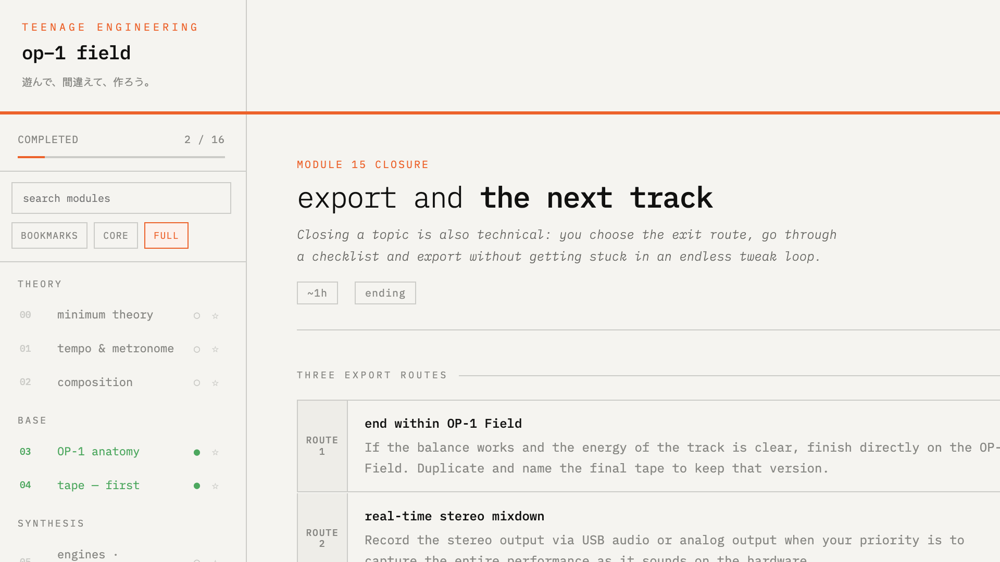

# OP-1 Field Learning App

Practical, offline-first course app for OP-1 Field users.

Built from a long manual and turned into a desktop app focused on learning by doing: short explanations, immediate exercises, interactive blocks, and a real workflow from first notes to export.



## What you get

- 16 learning modules (theory + hands-on production)
- Core path and full path
- Practice mode and reading mode
- Search, bookmarks, and progress tracking
- Language switch (ES / EN / JA)
- Works fully offline (local persistence)

## Quick start

```bash
npm install
npm run dev
```

## Main scripts

```bash
# Run app
npm run dev
npm start

# Quality checks
npm run qa
npm run lint
npm run test:e2e

# Build desktop installers
npm run dist
npm run dist:win
npm run dist:mac
```

Build outputs are generated in `dist/`.

## Project snapshot

- `index.html` + `assets/*` = app UI + course content
- `main.js` = Electron entry
- `assets/content/*.js` = modular module content (`m0..m15`, ES/EN/JA)
- `assets/locales/*.js` = UI language dictionaries + app text keys
- `docs/EDITING_GUIDE.md` = content editing notes
- `CONTRIBUTING.md` = contribution guide

## Contributing

PRs and fixes are welcome, especially:

- content clarity
- OP-1 Field accuracy
- language improvements
- new practical exercises

Run `npm run qa` before opening a PR.

---

遊んで、間違えて、作ろう。
